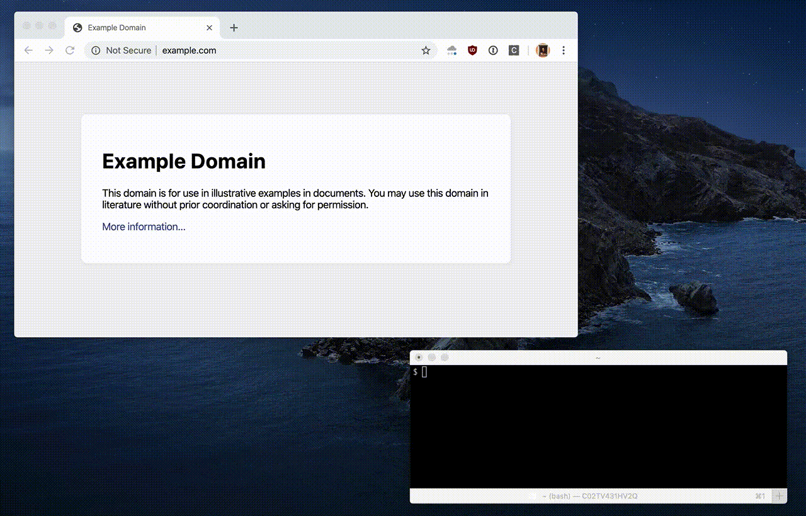

# Cloudflare Access tab auto close

Using Cloudflare access for ssh with tons of domains and tired of those endless
successful auth tabs that stick around? This extension closes tabs for you.

What it does:

* Closes tab on successful auth

What it doesn't do:

* Sets focus to previous used tab in browser
* Sets focus to terminal window that launched ssh

## Installation

This extension requires access to all websites, but [code](content.js) that
runs in the context of every page is pretty simple and doesn't try to sell
your browsing history or do anything like that. It's pretty scary to trust some
rando on the Internet that they won't change the code under you, the safest
option is to inspect the code and only upgrade after inspecting changes.

1. Clone this repo
2. Go to `chrome://extensions/` in Chrome
3. Enable "Developer mode" in upper right corner
4. Click new "Load unpacked" button and select the extension repo

Optionally, you can right click on `C` button of the extension to
"Hide in Chrome Menu", since there's no use for the button itself.
